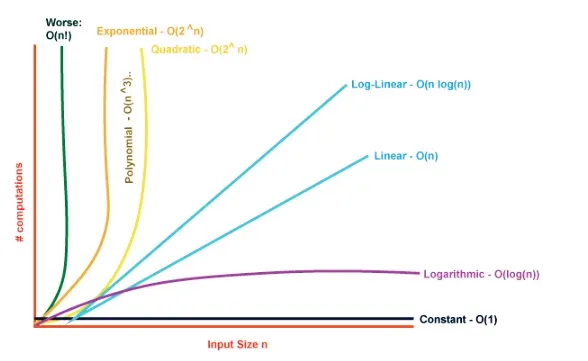

# **Complexity Analysis**
## ...

https://talks.obedmr.com/


---

# What's an algorithm?

_"An algorithm is an explicit, precise, unambiguous, mechanically-executable sequence of elementary instructions, usually intended to accomplish a specific purpose."_ - Jeff Erickson

___


# What about analyzing algorithms?

_"It’s not enough just to write down an algorithm and say “Behold!” We must also convince our audience (and ourselves!) that the algorithm actually does what it’s supposed to do, and that it does so efficiently"_ -  Jeff Erickson


There are 2 important things when analyzing algoritms, **correctness** and **running time.**

In this class, we're mostly occupied on **running time**, because we'd expect to write programs that do the right and correct thing, isn't it?

---

# Let's think about it ...

Imagine that you have 2 programs that do the same thing, how would you compare them?

- **Execution (running) time**
- Memory usage

---

# How we measure execution time?

The execution time depends on:

1. The program's input
   - Size
   - Characteristics
2. The quality of the generated code by the compiler
3. The fastness of the machine instructions
4. The **complexity of the algorithm's time**

---

# So, now, **what's complexity analysis?**

Complexity analysis **helps us understand how much time or space** an algorithm will need as the size of the input grows.

**The input is our data,** and the algorithms are the steps we take to process that data.

**We estimate** the **time** required to solve a problem or the amount of **memory** necessary based on our approach.

---


# Asymptonic Notation

- **Big-Oh (O) Notation:** It represents the maximum amount of time or space required by an algorithm considering all input values. It represents the upper limit of an algorithm’s execution time or space, offering insight into its *worst-case complexity.*

- **Big-Omega (Ω) notation:** It represents the minimum amount of time or space required by an algorithm considering all input values.

- **Big-Theta (Θ) notation:** It represents the upper and the lower bound of the running time of an algorithm, it is used for analyzing the average-case complexity of an algorithm.

---




---

# Time complexity?

_Time complexity measures the amount of time an algorithm takes to run as a function of the input size._

Algorithms with lower time complexity are generally more desirable as they can handle larger input sizes with reasonable runtimes.


---

## Constant Time O(1)

```
static void printFirstElement(int* array, int size) {
  if (size > 0) {
    std::cout << array[0] << std::endl;
  }
```

**Question:** How much time was required to get the first element of the array?

---


## Logarithmic Time: O(log n)

```
static bool binarySearch(const std::vector<int>& array, int target) {
  int left = 0;
  int right = array.size() - 1; // Use array.size() for vector length

  while (left <= right) {
      int mid = left + (right - left) / 2;

      if (array[mid] == target) {
    return true;
      }
      if (array[mid] < target) {
    left = mid + 1;
      } else {
    right = mid - 1;
      }
  }
  return false;
}
```

---

## Linearithmic Time: O(n log n)

```
int main() {
    std::vector<int> array = {5, 3, 8, 1, 2};
    quicksort(array); // O(n log n)
}
```

What's `quickstort`? no worries, we'll see it in the coming weeks.

---

## Quadratic Time: O(n²)

``` 
static void printAllPairs(const std::vector<int>& array) {
  for (size_t i = 0; i < array.size(); ++i) {
    for (size_t j = 0; j < array.size(); ++j) {
      std::cout << "(" << array[i] << ", " << array[j] << ")" << std::endl;
    }
  }
}
```

**Question:** How much time does this program takes to execute?

---

# Space Complexity?

_Space complexity is pretty much a measurement of the total amount of memory that algorithms or operations need to run according to their input size._

Algorithms with lower space complexity are preferred as they optimize memory usage, especially in environments with limited resources.

---

## Constant Space: O(1)

```
static void printSum(int a, int b) {
  int sum = a + b;
  std::cout << sum << std::endl;
}
```

---


## Linear Space: O(n)

```
#include <vector>

void createArray(int size) {
    std::vector<int> array(size);
    for (int i = 0; i < size; ++i) {
        array[i] = i;
    }
}
```

---


##  Quadratic Space: O(n²)

```
#include <vector>

void createMatrix(int size) {
    std::vector<std::vector<int>> matrix(size, std::vector<int>(size)); 

    for (int i = 0; i < size; ++i) {
        for (int j = 0; j < size; ++j) {
            matrix[i][j] = i * j;
        }
    }
}
```

---


## Question: Which complexity would you assign to this?

$O(1)$, $O(n)$ or $O(n^2)$ ?

```
sum = 0;
for (int i=1; i<=n; i++)
   suma += array[i];
```

---


# Rules to calculate complexity

1. Sequence of instructions
2. Decisions (e.g. `if`)
3. Loops (e.g. `for`, `while`)
4. Recursivity

---


# Let's code:

Implement the following 2 functions in the `LinkedList` class.

- `int Size();`
  _Returns the number of elements of the linked list_
- `void Delete(T value);`
  _Deletes `value` from the linked list. If the `value` doesn't exist, do nothing_

Source code: [linked_list.cpp](./src/linked_list.cpp)


---

# Resources and Credits
This material is genereated thanks to some extracts from following resources:

- Weiss, Mark Allen. *Data Structures and Algorithm Analysis in C++*. 4th ed. Boston: Pearson, 2014.
- Humberto González, Luis. *Abstraccion de Datos*
- Erickson, Jeff. *Algorithms* ...

- https://thegeekplanets.medium.com/the-ultimate-guide-to-complexity-analysis-in-data-structures-and-algorithms-c4f9be147a54
- Google-generated code with `AI Overview`

---

# Thanks

- **Obed N Muñoz Reynoso**
	- obed.n.munoz@tec.com
	- @obedmr
