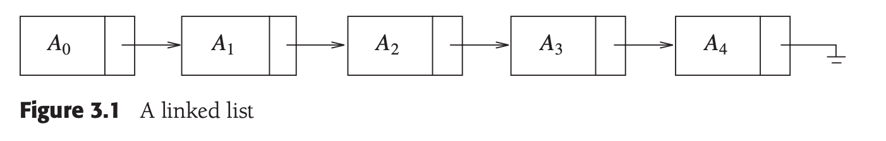
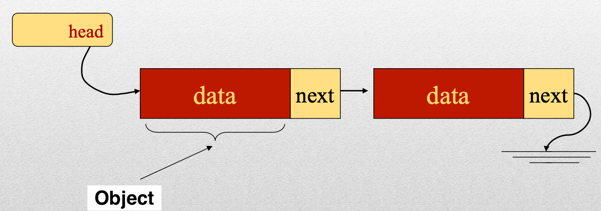
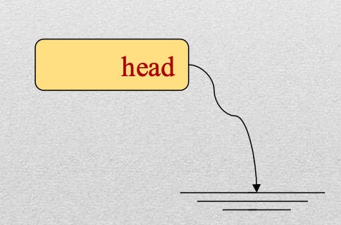
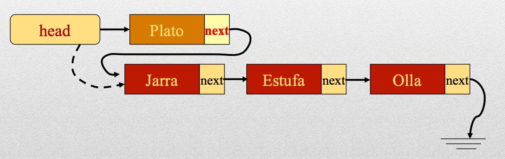
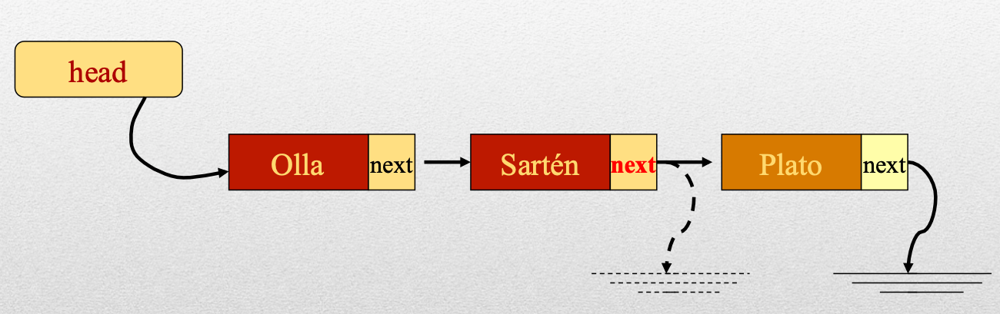

# **Data Abstraction**
## ...

https://talks.obedmr.com/


---

# Data types

In a programming language, a data type can be defined in:

- A range of values and
- A set of valid operations that can apply to those values

**Example:**

In C++, the `int` data type holds a range of values from -2,147,483,648 to 2,147,483,647. And the operations that you can do with `int` values are addition, subtraction, multiplication, division, ...

---


# Data types 2/2

```
#include <iostream> // For std
#include <climits>  // For INT_MIN and INT_MAX

using namespace std; // Brings the std namespace into scope

int main() {
    cout << "Minimum value for int: " << INT_MIN << endl;
    cout << "Maximum value for int: " << INT_MAX << endl;
    return 0;
}
```

source code: [int_limits.cpp](./src/int_limits.cpp)

---


#  Data Structures 1/2

- They can be decomposed into a set of elements that can be simple data types or other data structures.
- Includes a set of associations or relationships between the elements

**Example:**
An array is a pre-defined data structure in C++

---


# Data Structures 2/2

```
    int numbers[5] = {10, 20, 30, 40, 50};

    cout << "All elements of the array:" << endl;
    for (int i = 0; i < 5; ++i) {
        cout << "Element at index " << i << ": " << numbers[i] << endl;
    }
}
```

Source Code: [data_structs_array.cpp](./src/data_structs_array.cpp)

---

# Abstraction?

_**A mental process** that extracts the **essential features** of "something" in order to represent them **through a graphic or written language.**_

---


# So, Data Abstraction

- It's a methodology that is used to design data structures
- During the design of the data structure:
  - Details about implementation could be ignored
  - It requires to think out of an specific programming language box
  - You first design, later implement

---


# Abstract Data Type (ADT)

- Is a set of objects together with a set of operations
- Abstract data types are mathematical abstractions
- Nowhere in an ADT’s definition is there any mention of how the set of operations is implemented
- Objects such as lists, sets, and graphs, along with their operations, can be viewed as ADTs
- Common operations on ADTs are: `add`, `remove`, `size` and `contains`

---

## ADT: Logical Specification

Some key things to consider:
- Elements
- Type of organization
- Domain
- Operations

---


# ADT: Elements

Define the data type of the elements that the ADT structure will store

**Examples:**
- Dates
- Names
- Age
- Classes
- others ...

---


# ADT: Organization


---


# ADT: Domain

It defines the range of possible values that can be stored and operated upon the structure

**Example: Character ADT**

_The domain is the set of all characters representable by a specific character encoding (e.g., ASCII, Unicode). Operations include comparison, conversion to uppercase/lowercase, checking character type (digit, letter, etc.)._

---


# ADT: Operations

For each of the operations, the following should be considered:

- Name of the operation
- Brief description of its usefulness
- Input data
- Output data
- Pre-conditions
- Post-conditions

**Example:** Take a look in the [queue](https://cplusplus.com/reference/queue/queue/) ADT and its operations

---


## ADT: Operations - Pre-conditions

**Pre-condition:**
_It is the condition that must be met before executing the operation, so that it work properly_

**Question:**
What would be a _pre-condition_ for using the [`push()`](https://cplusplus.com/reference/queue/queue/push/) function?

---


## ADT: Operations - Post-conditions

**Post-condition:**
_Description of the state in which the ADT remains after executing the operation_

**Question:**
What would be a _post-condition_ for using the [`pop()`](https://cplusplus.com/reference/queue/queue/pop/) function?

---


# ADT: Levels of Abstraction

- **Logical or abstract**. At this level, the ADT is designed through logical specification
- **Physical or implementation**. At this level, each of the ADT's operation is implemented (ie. `size`, `push`, `pop`, `empty` ...)
- **Aplication or use**. At this level, programs are implemented that will use the data structure (ADT).

---


# ADT: At which level of abstraction? 1/2

**Use case:**

Let's think about a `square_root` function. If the pre-condition for the operation that obtains the square root of a number is: _“the number must be positive”_.

**Question**: At what level of abstraction must it be verified that the number to be square rooted is positive?

---


# ADT: At which level of abstraction? 2/2

**Answer:**

_**The Application Level**, since the number must be verified to be positive **BEFORE** calling the operation._

---


# Data types

- Primitives or Scalars - _they have a single value_
  Examples: `int`, `float`, `bool`, `char`
- Compounds - _collection of elements_
  Examples: `arrays`, `pointers`, `structs`, `unions`, `enums`, `classses` ...
  - These can be:
    - homogeneous (e.g. array)
    - heterogeneous (e.g. a class)
    - combined (e.g. an array of objects)

---


# Characteristics of the arrays

- They contain homogeneous data
- You can access the _i-th_ element directly
- They're commonly defined by a fixed size, so you cannot add more elements
- If it's not used completely, it's a waste of memory space
- To insert an element in an occupied space, it's neeeded to move all the other elements

---

# Linked Lists

---

## Linked Lists: Intro 1/3

- The linked list consists of a series of nodes (or elements), which are not necessarily adjacent in memory.
- Each node contains the element and a link to a node containing its successor. We call this the `next` link.
- The last cell’s next link points to `nullptr`.




---


## Linked Lists: Intro 2/3

- Each node in the list will be created on demand; so, no memory space is used until required, and memory space is not necessarily continuous.
- Above property can be seen as disadvantage, because it's required for every node to store "extra" information about the next node.


---


## Linked Lists: Intro 3/3

- Each node in the linked list contains one field called `next`
- The `next` field of the last node contains `null`




---


## Linked Lists: The `Node` class

```cpp
template <typename T>
class Node {
public:
  T data;
  Node<T>* next;
  Node(T value): data(value), next(nullptr) {};
};
```
Source code: [node.h](./src/node.h)

---

## Linked Lists: The `LinkedList` class

```cpp
template <typename T>
class LinkedList {

private:
  int size;
  Node<T> *head;

public:
  LinkedList() {
    head = NULL;
    size = 0;
  }
};
```

Source code: [linked_list.cpp](./src/linked_list.cpp)

---


## Linked Lists: a first glance

- We will call the reference to the first node in the list `head`.
- An empty list will have `null` in the `head`.




--- 

## Linked Lists: `AddFirst` operation 1/3

**Action:**
The element is added at the beginning of the list

**Procedure**:
  - It will look for the `head`of the list and it will point to the new element
  - The new node will have its `next` field pointing to the last node that was pointed by the `head`

---


## Linked Lists: `AddFirst` operation 2/3

```
linked_list.AddFirst("Plato");
```



---


## Linked Lists: `AddFirst` operation 3/3

```cpp
  void AddFirst(T value) {
    Node<T>* new_node = new Node<T>(value);
    new_node->next = head;
    head = new_node;
  }
```

Source code: [linked_list.cpp](./src/linked_list.cpp)

---


## Linked Lists: `AddLast` operation 1/3

**Action:**
The element is added at the **end** of the list

**Procedure**:
  - It will go the the **end** of the list, and
  - at the last element, the `next` field will be modified to the new created `node`

---


## Linked Lists: `AddLast` operation 2/3

```
linked_list.AddLast("Plato");
```



---


## Linked Lists: `AddLast` operation 3/3

<style scoped>
  pre > code {
  font-size: 60%;
}
</style>

```cpp
  void AddLast(T value) {
    Node<T>* new_node = new Node<T>(value);
    
    if (head == nullptr) {
      head = new_node;
      return;
    }
    
    Node<T>* current = head;
    while (current->next != nullptr) {
      current = current->next;
    }
    
    current->next = new_node;
  }
```


Source code: [linked_list.cpp](./src/linked_list.cpp)

---


# Let's code:

Implement the following 2 functions in the `LinkedList` class.

- `int Size();`
  _Returns the number of elements of the linked list_
- `void Delete(T value);`
  _Deletes `value` from the linked list. If the `value` doesn't exist, do nothing_

Source code: [linked_list.cpp](./src/linked_list.cpp)


---

# Resources and Credits
This material is genereated thanks to some extracts from following resources:

- Weiss, Mark Allen. *Data Structures and Algorithm Analysis in C++*. 4th ed. Boston: Pearson, 2014.
- Humberto González, Luis. *Abstraccion de Datos*
- Google-generated code with `AI Overview`

---

# Thanks

- **Obed N Muñoz Reynoso**
	- obed.n.munoz@tec.com
	- @obedmr
