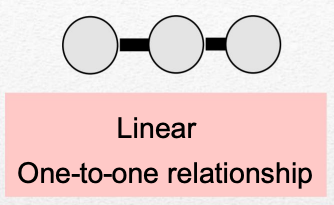
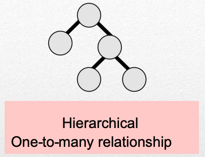
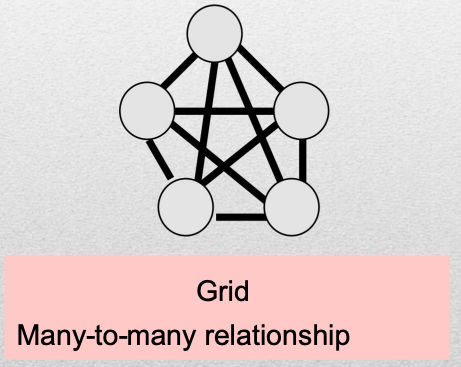
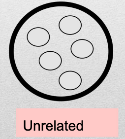

# **1. Data Abstraction**
## ...

https://talks.obedmr.com/


---

## Data types

In a programming language, a data type can be defined in:

- A range of values and
- A set of valid operations that can apply to those values

**Example:**

In C++, the `int` data type holds a range of values from -2,147,483,648 to 2,147,483,647. And the operations that you can do with `int` values are addition, subtraction, multiplication, division, ...

---

## Data types 2/2

```
#include <iostream> // For std
#include <climits>  // For INT_MIN and INT_MAX

using namespace std; // Brings the std namespace into scope

int main() {
    cout << "Minimum value for int: " << INT_MIN << endl;
    cout << "Maximum value for int: " << INT_MAX << endl;
    return 0;
}
```

source code: [int_limits.cpp](./src/int_limits.cpp)

---


##  Data Structures 1/2

- They can be decomposed into a set of elements that can be simple data types or other data structures.
- Includes a set of associations or relationships between the elements

**Example:**
An array is a pre-defined data structure in C++

---


## Data Structures 2/2

```
    int numbers[5] = {10, 20, 30, 40, 50};

    cout << "All elements of the array:" << endl;
    for (int i = 0; i < 5; ++i) {
        cout << "Element at index " << i << ": " << numbers[i] << endl;
    }
}
```

Source Code: [data_structs_array.cpp](./src/data_structs_array.cpp)

---

# Abstraction?


_**A mental process** that extracts the **essential features** of "something" in order to represent them **through a graphic or written language.**_

---

## So, Data Abstraction

- It's a methodology that is used to design data structures
- During the design of the data structure:
  - Details about implementation could be ignored
  - It requires to think out of an specific programming language box
  - You first design, later implement

---


## Abstract Data Type (ADT)

- Is a set of objects together with a set of operations
- Abstract data types are mathematical abstractions
- Nowhere in an ADT’s definition is there any mention of how the set of operations is implemented
- Objects such as lists, sets, and graphs, along with their operations, can be viewed as ADTs
- Common operations on ADTs are: `add`, `remove`, `size` and `contains`

---

## ADT: Logical Specification

Some key things to consider:
- Elements
- Type of organization
- Domain
- Operations

---

## ADT: Elements

Define the data type of the elements that the ADT structure will store

**Examples:**
- Dates
- Names
- Age
- Classes
- others ...

---

## ADT: Organization






---

## Let's code:


---

# Resources and Credits
This material is genereated thanks to some extracts from following resources:

- 


---

# Thanks

- **Obed N Muñoz Reynoso**
	- obed.n.munoz@tec.com
	- @obedmr
