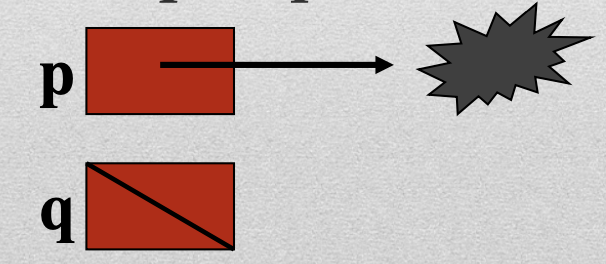

# **10 things about memory management**
## in C++

https://talks.obedmr.com/

---

# 1. if `new`, then `delete`

For every `new`, a `delete` must exist before closing the program

**Think and test:**
- What happens if we forget to add the `delete`?
- What happens if we put an extra `delete`?

---


# 2. `delete` frees memory

The `delete` will free the memory that is pointed to, regardless of whether there are more pointers to the same space.

```
int *p, *q, *r;
p = new int;
q = r = p;
delete r;
```

**Think and test:**
- What happens with `*p` and `*r`?

---

# 3. scope matters

A local pointer that is created in a module (e.g. function) is destroyed at the end of its execution, regardless of the memory space it references. **It is important** to perform a `delete` before terminating the module's execution to avoid leaving memory _"floating"_.


**Think and test**
```
int* foo(){
  int a = 700, *b = &a;
  return b;
}
```

---


# 4. Garbage is different than `NULL`

```
int *p, *q = NULL;
```


**Think and test:**
- Print both values

---


# 5. Make sure that you `delete` something

Performing a `delete` with a pointer that does not reference a dynamic memory space will cause runtime failures.

**Think and test:**
- If it doesn't point to a space, what is freed up?

---


# 6. Make sure that you point to something

A reference through a pointer whose value is `NULL` will cause program execution to fail.

**Think and test:**
- If it doesn't point to a space, what is accessed?

---


# 7. Be careful with `new`

When assigning a value to a pointer with the `new` operation, the pointer will lose its previous value, regardless of what it points to.

**Think and test:**
- What happens with the old data?

---

# 8. `new` is not the only option

To use a pointer, you don't always have to perform a `new`

In addition to `new`, a pointer can be given a value using the `&` operator, or by assigning it the value of another pointer.

**Think and test:**
- What's the difference between `p` and `r` in following examples?

```
int *p, q = 10, *r;
p = &q;
r = p;
```

---


# 9. Comparing pointers

Pointer values can be compared to verify that they point to the same place. We can only use `==` and `!=` operators.

**Think and test:**
- What about the `>`, `<`, `>=` and `<=` operators?

---


# 10. Operations on referenced data

All operations valid for the data type can be applied to a data referenced by a pointer.

**Think and test:**
- Verify basic operations in the following pointers
```
string *a = new string("my string");
int *b = new int(3);
```

---


# Resources and Credits
This material is genereated thanks to some extracts from following resources:

- Humberto González, Luis. *Abstraccion de Datos*
- Google-generated code with `AI Overview`

---

# Thanks

- **Obed N Muñoz Reynoso**
  - obed.n.munoz@tec.com
  - @obedmr
