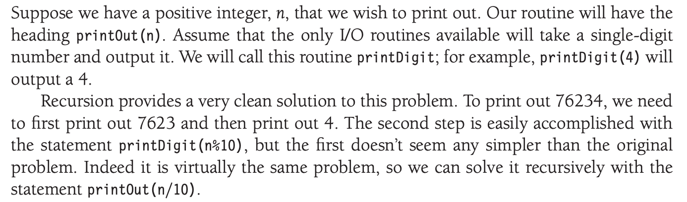
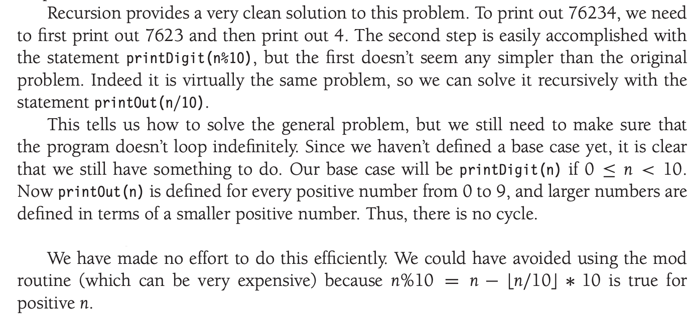

# **Recursion**
## ...

https://talks.obedmr.com/


---

# Let's start with functions

Most mathematical functions that we are familiar with are described by a simple formula

**Example:** converting from Fahrenheit to Celcius

$C = 5(F-32)/9$ 

```
float fahrenheit_to_celsius(float fahrenheit) {
    return (fahrenheit - 32.0) * 5.0 / 9.0;
}
```

---


# So, what about this function?

$f(x) = 2f(x − 1) + x^2$

Considering that $f(0) = 0$, we will see that $f(1) = 1, f(2) = 6, f(3) = 21$ and $f(4) = 58$

A function that is defined in terms of itself is called **recursive**.

Without defining the $f(0) = 0$, the $f$ function would be meaningless, mathematically. **Can you see that?**

---


# The **base case**

When doing recursive functions, the $f(0) = 0$ is going to be called the **base case**.

A `recurive` function will not make any sense without the **base case**.

**Question:** Where is the `base case`?

```
int f(int x) {
  if ( x == 0 )
    return 0;
  else
    return 2 * f( x - 1 ) + x * x;
}
```

---


# A `bad` recursion example

Consider the following function and try to find out where is the issue:

```
int bad(int n) {
  if ( n == 0 )
    return 0;
  else
    return bad(n / 3 + 1 ) + n - 1;
}
```

We have a non-terminating recursive function - [bad_recursion.cpp](./src/bad_recursion.cpp).

How could we get out of the non-terminating case?

---

# Printing out Numbers



---



---


# Printing out Numbers: the solution

```
void printOut (int n) {
  if ( n >= 10 )
    printOut( n / 10 );
  printDigit(n % 10);
}
```

**Question:**
What would be the order of call to functions `printOut()` and `printDigit()` if we initially call `printOut(355)`?

---


# Let's code:

Implement a recursive function to find a digit in any given float number. Consider the following requirements.

- The function's signature should be `find_digit(float n, int d)`
- The maximum supported decimal places are `4`
- The function will return `1` if the digit is found at least 1 time, otherwise, it will return `0`
- **Recomendation:** start easy, start with `int` numbers, once you have something working, move to `float` numbers.

Source code: [find_digit.cpp](./src/find_digit.cpp)


---

# Resources and Credits
This material is genereated thanks to some extracts from following resources:

- Weiss, Mark Allen. *Data Structures and Algorithm Analysis in C++*. 4th ed. Boston: Pearson, 2014.
- Google-generated code with `AI Overview`

---

# Thanks

- **Obed N Muñoz Reynoso**
	- obed.n.munoz@tec.com
	- @obedmr
