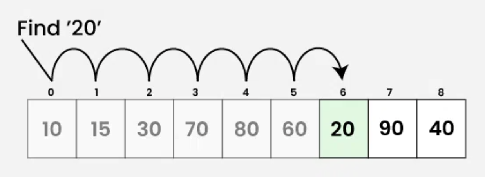
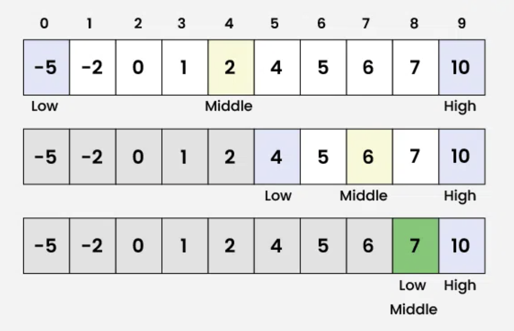

# **Search Algorithms**
## ...

https://talks.obedmr.com/

---

# Search Algorithms

We want to find something. There's a big store, how to find an object there? So, let's implement an algorithm to find it.

There are 2 main types of search algorithms:

- Sequential Search $O(n)$
- Binary Search $O(log~n)$

---


## Search Algorithms : sequential search

Searches for the key by scanning one element after another.
- This is the only way to locate when the list is not sorted by the search key.
- Its complexity or running time is $O(n)$




---

## Search Algorithms : sequential search

```
template <typename T>
int sequentialSearch(const std::vector<T>& arr, const T& target) {
    for (int i = 0; i < arr.size(); ++i) {
        if (arr[i] == target) {
            return i; // Return the index if target is found
        }
    }
    return -1; // Return -1 if target is not found
}
```

Source code: [`sequential_search.cpp`](./src/sequential_search.cpp)

---

## Search Algorithms : binary search

It will be used in sorted lists by the search key, this is the best method.

- The reading is placed in the middle of the list and checked against the key
  - If `key < a[middle]`: Search between `lower` and `middle–1`
  - If `key > a[middle]`: Search between `middle+1` and `higher`
- Sort efficiency $O(log_2n)$

---

## Search Algorithms : binary search



---


## Search Algorithms : binary search

```
int binarySearch(const std::vector<T>& arr, const T& target) {
    int low = 0;
    int high = arr.size() - 1;

    while (low <= high) {
        int mid = low + (high - low) / 2; // Avoids potential overflow compared to (low + high) / 2

        if (arr[mid] == target) {
            return mid; // Target found
        } else if (arr[mid] < target) {
            low = mid + 1; // Search in the right half
        } else {
            high = mid - 1; // Search in the left half
        }
    }
    return -1; // Target not found
}
```

Source Code: [`binary_search.cpp`](./src/binary_search.cpp)

---

## Search Algorithms : recursive binary search

```
int binarySearch(vector<int> &arr, int low, int high, int x) {
    if (high >= low) {
        int mid = low + (high - low) / 2;
        if (arr[mid] == x)
            return mid;
        if (arr[mid] > x)
            return binarySearch(arr, low, mid - 1, x);
        return binarySearch(arr, mid + 1, high, x);
    }
  return -1;
}
```

**Question:** Would it work? What would be its complexity in the $big-O$ notation? Test it in the [`binary_serach.cpp`](./src/binary_search.cpp) file

---


# Let's code: Generic Search

Write one program that will be able to sort `float`, `int` and `string` arrays. Arrays will come from a user-provided file. Consider that you will need to sort it, if the users chooses the binary search.

Below you can see how your program will be run:

- ``./main --input data.txt --binary-search``
- ``./main --input data.txt --recursive-binary-search``
- ``./main --input data.txt --sequential-search``

At the end, compare your running time with the [`grep`](https://man7.org/linux/man-pages/man1/grep.1.html) program.

---


# Resources and Credits
This material is genereated thanks to some extracts from following resources:

- Weiss, Mark Allen. *Data Structures and Algorithm Analysis in C++*. 4th ed. Boston: Pearson, 2014.
- Humberto González, Luis. *Abstraccion de Datos*
- Erickson, Jeff. *Algorithms* ...
- Google-generated code with `AI Overview`

---

# Thanks

- **Obed N Muñoz Reynoso**
	- obed.n.munoz@tec.com
	- @obedmr
