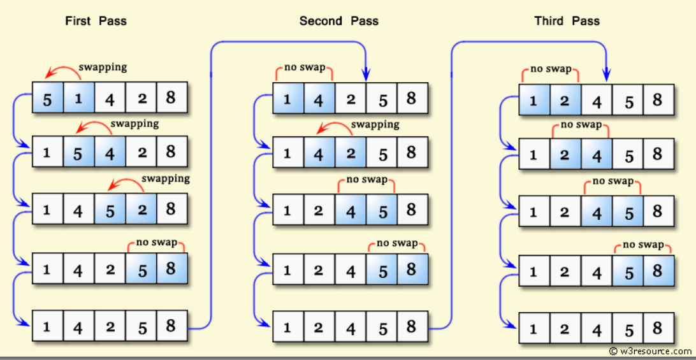
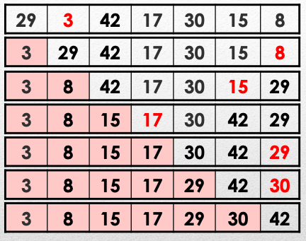
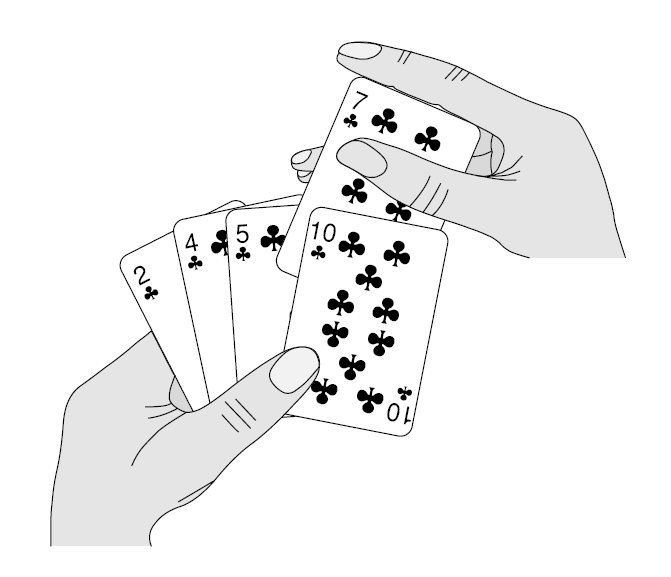

# **Sorting Algorithms**
## ...

https://talks.obedmr.com/

---

# Sorting Algorithms: Why should we care?

Simple, if we don't sort them, we cannot find it

**Think about** a list of unsorted phone numbers from the `Contacts` App in your phone. And also, imagine that you don't have a seach field. How would you find your contacts?

---


# Common Algorithms

- Bubble Sort
- Selection Sort
- Insertion Sort
- MergeSort
- QuickSort
- Shell Sort
- Heap Sort
- Bucket Sort
- ....  `<your>` sort

---


# How we choose the best sorting algorithm?

- Execution time (a.k.a. complexity: $O(log\,n)$, $O(n^2)$, $O(n\,log\,n)$, ...)
  - Number of comparisons
  - Number of movements
- Data size and structure
- Available resources (memory, cpu, storage ...)
- Data type (strings, numbers, combined, ...)
- **What else?**

---


## Bubble Sort 1/4

_Compares in bubbles (pairs), from the beginning of the array to the end. If the first element of the bubble is bigger, the 2 elements will be swapped._

The above process is repeated through the whole array until there are no more swaps to do.

**Its complexity:**
- Best Case - $O(n)$
- Worst Case -  $)(n^2)$

---


## Bubble Sort 2/4



---


## Bubble Sort 3/4

```
void bubbleSort(std::vector<int>& arr) {
    int n = arr.size();
    bool swapped; // Flag to check if any swaps occurred in a pass

    for (int i = 0; i < n - 1; ++i) {
        swapped = false; // Reset swapped flag for each pass
        for (int j = 0; j < n - 1 - i; ++j) {
            // Compare adjacent elements
            if (arr[j] > arr[j + 1]) {
                // Swap if they are in the wrong order
                std::swap(arr[j], arr[j + 1]);
                swapped = true; // Mark that a swap occurred
            }
        }
        // If no two elements were swapped in inner loop, then array is sorted
        if (swapped == false) {
            break;
        }
    }
}
```

---


## Bubble Sort 4/4

**Quick Excersice:**

_Given the `arr` array, calculate the number of comparisons and the number of swaps_

```
std::vector<int> myVector = {64, 347, 5, 12, 212, 11, 920, 64, 37, 25, 72, 22, 96, 90};
```

Source Code: [`bubble_sort.cpp`](./src/bubble_sort.cpp)

---


## Selection Sort 1/4

_It will search for the minimum (or maximum) value in the array, then it will go through the rest of the array and if it finds a smaller value, they will swap their position._

The above process is repeated with all the array, previous sorted values will not be visited anymore.

**Its complexity:**
- Best/Worst Case - $O(n^2)$

---


## Selection Sort 2/4



---


## Selection Sort 3/4

```
void selectionSort(std::vector<int>& arr) {
    int n = arr.size();
    for (int i = 0; i < n - 1; ++i) {
        // Find the minimum element in the unsorted part of the array
        int min_idx = i;
        for (int j = i + 1; j < n; ++j) {
            if (arr[j] < arr[min_idx]) {
                min_idx = j;
            }
        }
        // Swap the found minimum element with the first element of the unsorted part
        if (min_idx != i) {
            std::swap(arr[min_idx], arr[i]);
        }
    }
}
```

---


## Selection Sort 4/4

**Quick Excersice**

_Is it really $O(n^2)$? Let's verify it_

Source Code: [`selection_sort.cpp`](./src/selection_sort.cpp)

---

## Insertion Sort 1/5

_The process of sorting an array with insertion sort is similar to how a person might sort a hand of playing cards_

**Its complexity:**
- Best Case - $O(n)$
- Worst Case - $O(n^2)$



---


1. The algorithm starts with the first element, which is considered the sorted portion of the array.

2. It then takes the next element (from the unsorted portion) and compares it with the elements in the sorted portion, moving from right to left.

3. As it compares, it shifts any element larger than the current value one position to the right to create a space for insertion.

4. The current element is then inserted into its correct position.

5. This process repeats for each element until the entire array is sorted.

---


---


## Insertion Sort 4/5

```
void insertionSort(std::vector<int>& arr) {
    int n = arr.size();
    for (int i = 1; i < n; ++i) {
        int key = arr[i];
        int j = i - 1;

        // Move elements of the sorted subarray that are greater
        // than the key to one position ahead of their current position.
        while (j >= 0 && arr[j] > key) {
            arr[j + 1] = arr[j];
            j = j - 1;
        }
        arr[j + 1] = key;
    }
}
```

---


## Insertion Sort 5/5

**Quick Excersice**

_What would the worst case scenario?_
_Write a 5 elements array. You may need to verify it_

```
arr = {   ,   ,   ,   ,   }
```

Source Code: [`insertion_sort.cpp`](./src/insertion_sort.cpp)

---


## Merge Sort


---


## Quick Sort


---


###

## Let's code: Heap, Shell and Bucket Sort

For a 10,000,000 randomized integers array

- Investigate and implement the `HeapSort`, `ShellSort` and `BucketSort` algorithms
- Add the `BubbleSort`, `SelectionSort`, `InsertionSort`, `QuickSort` and `MergeSort` to your program
- Calculate the running time and memory usage for each algorithm to find out which one is  the fastest algorithm for the given array
- Explain why the winner algorithm would be the optimal and where it would not be optimal


---


# Resources and Credits
This material is genereated thanks to some extracts from following resources:

- Weiss, Mark Allen. *Data Structures and Algorithm Analysis in C++*. 4th ed. Boston: Pearson, 2014.
- Humberto González, Luis. *Abstraccion de Datos*
- Erickson, Jeff. *Algorithms* ...
- Google-generated code with `AI Overview`

---

# Thanks

- **Obed N Muñoz Reynoso**
	- obed.n.munoz@tec.com
	- @obedmr
